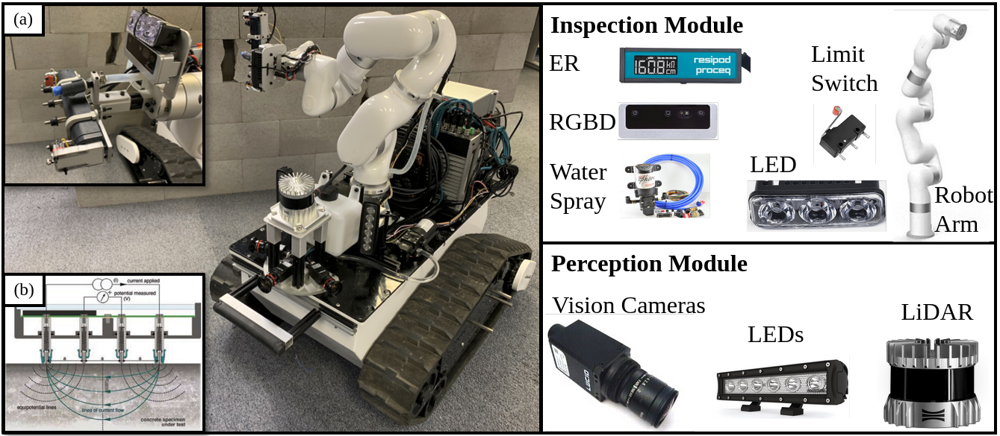

# MS-CAIS: Multi-Sensor Culvert Autonomous Inspection System
**The effective operation of civil infrastructure is crucial for economic stability. To ensure continued performance, regular maintenance is essential. However, underground infrastructure, like culverts and tunnels, posed more significant challenges in managing and preserving these critical assets such as maneuverability and danger,  slow labor-intensive, defect localization, and superficial assessment. In this paper, we propose a cost-effective solution for infrastructure inspection through the development of MS-CAIS, a Multi-Sensor (MS) Culvert Autonomous Inspection System. Our solution integrates multiple vision cameras, a densed LiDAR, a deep learning based defect segmentation system, lighting systems, and non-destructive evaluation (NDE) methods for a comprehensive condition assessment. In addition, we integrate a Partially Observable Markov Decision Process (POMDP) framework to find and assess defect areas in confined and unstructured underground environments. Furthermore, we provide an open-source implementation of our framework on GitHub.**

<p align='center'>
    
</p>

## Dependencies
The framework has been tested with ROS Noetic and Ubuntu 20.04. The following configuration, along with the required dependencies, has been verified for compatibility:

- [Ubuntu 20.04](https://releases.ubuntu.com/focal/)
- [ROS Noetic](http://wiki.ros.org/noetic/Installation/Ubuntu) 
- [Depthai Dependencies](https://docs.luxonis.com/software/ros/depthai-ros/build/)
- [CUDA](https://developer.nvidia.com/cuda-downloads) (Recommend to use CUDA toolkit >= 11 for Ubuntu 20.04)
- [ultralytics](https://github.com/ultralytics)


## ROS package
- [depthai-ros](https://github.com/luxonis/depthai-ros/tree/noetic)
- [dlio](https://github.com/vectr-ucla/direct_lidar_inertial_odometry)
- [bunker_ros](https://github.com/agilexrobotics/bunker_ros)
- [turtlebot3](https://github.com/ROBOTIS-GIT/turtlebot3) (for simulations)
- [turtlebot3_simulations](https://github.com/ROBOTIS-GIT/turtlebot3_simulations) (for simulations)
- [cv_bridge](https://github.com/ros-perception/vision_opencv)
- [velodyne](https://github.com/ros-drivers/velodyne) (for simulations)
- [gazebo](https://gazebosim.org/docs/latest/ros_installation/)
- [rosserial](https://github.com/ros-drivers/rosserial)
- [ouster_ros](https://github.com/ouster-lidar/ouster-ros)
- [rosserial_arduino](http://wiki.ros.org/rosserial_arduino/Tutorials/Arduino%20IDE%20Setup)

## Install
Use the following commands to download and build the package: (The code is implemented in ROS1)

```
    # caktin_ws or your workspace dir 
    mkdir -p ~/catkin_ws/src 
    cd ~/caktin_ws/src    
    git clone https://github.com/aralab-unr/MS_CAIS.git
    cd ..
    catkin build
    source devel/setup.bash
```
